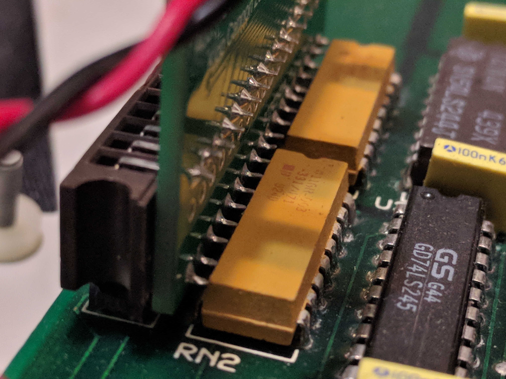
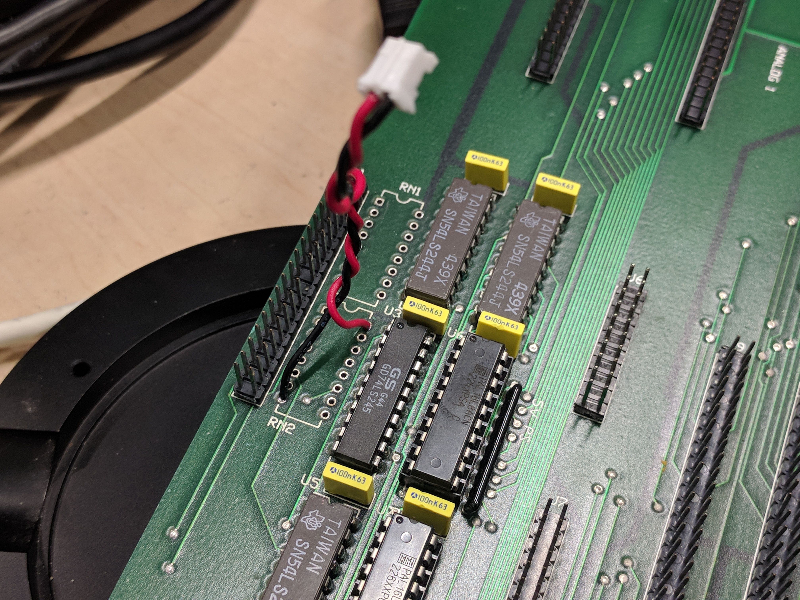
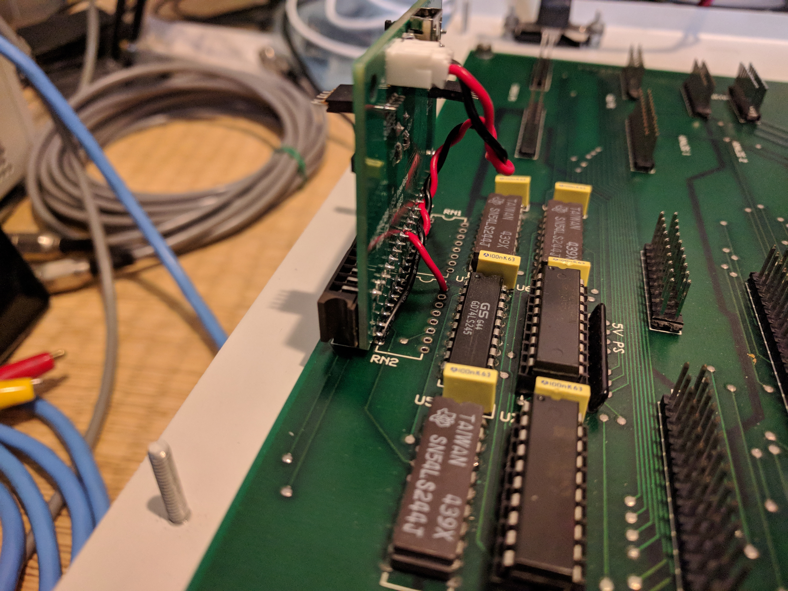
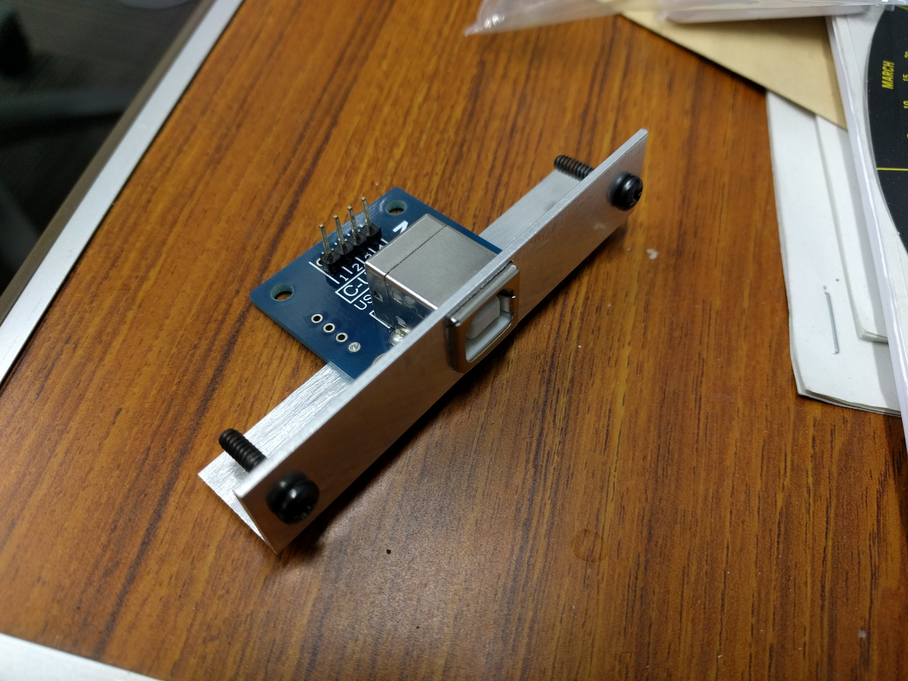
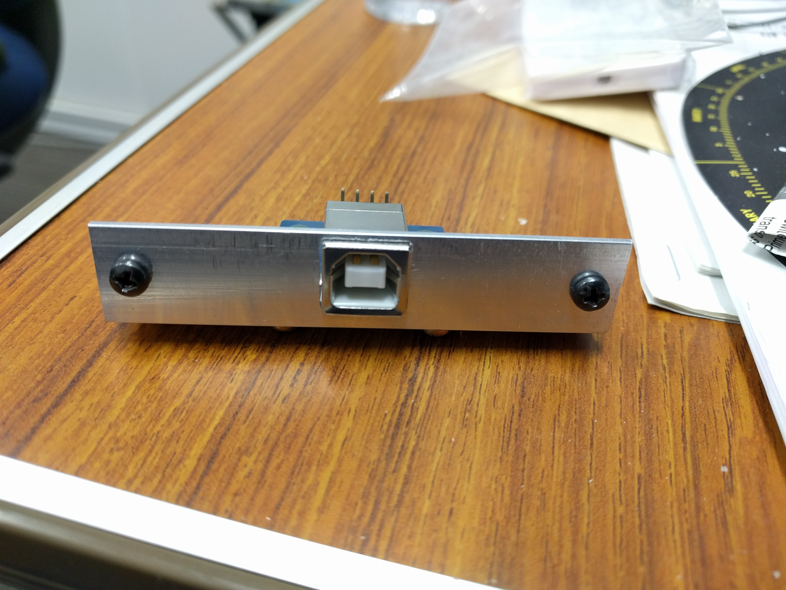
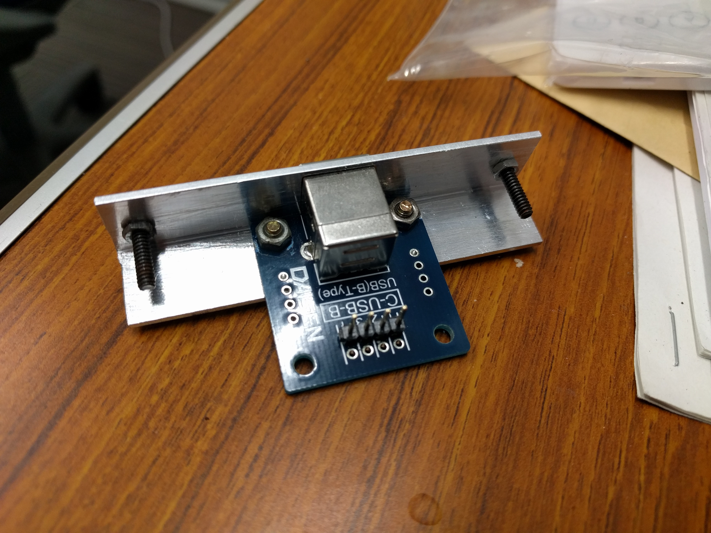
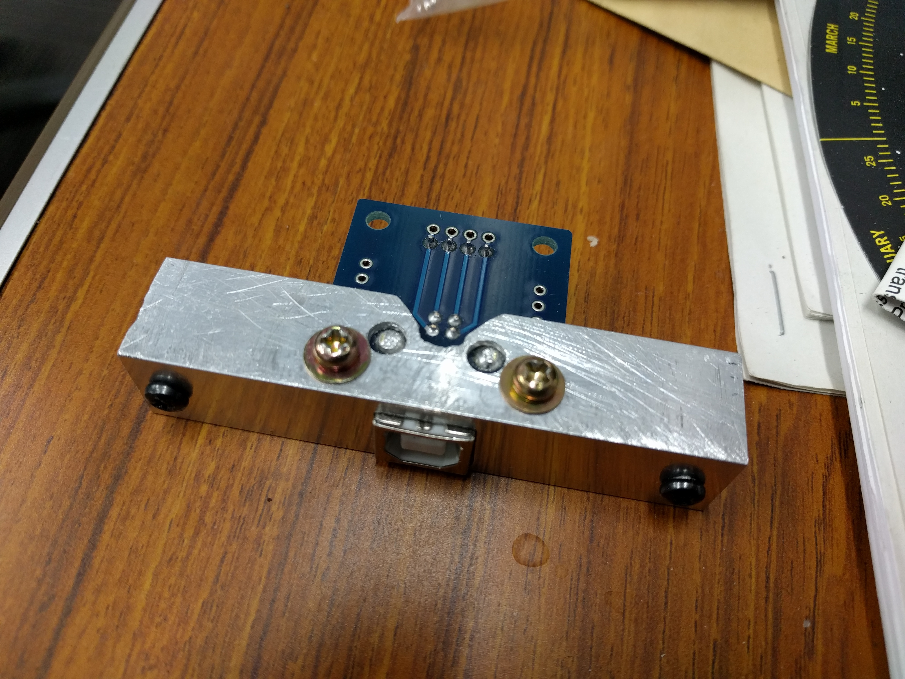
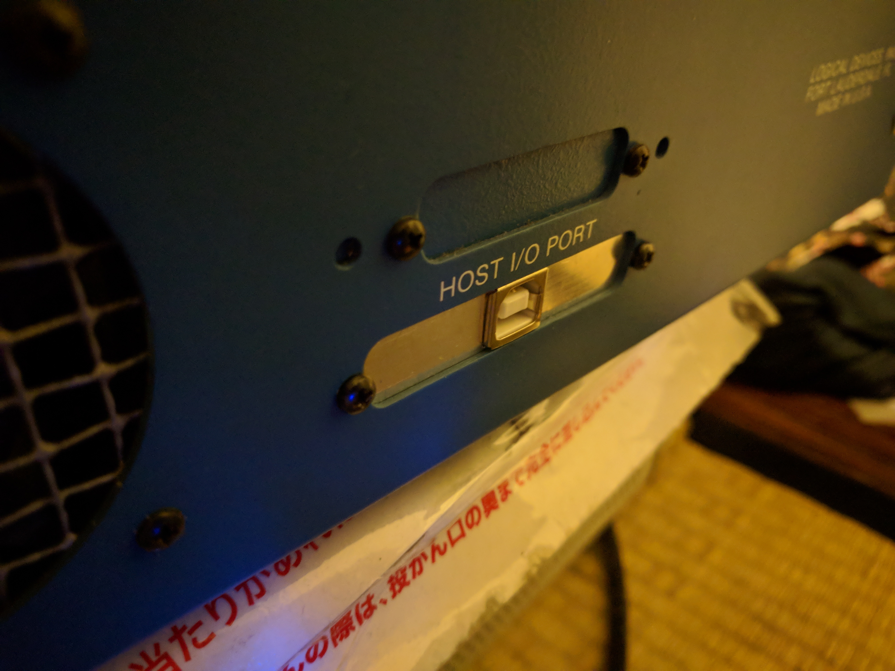
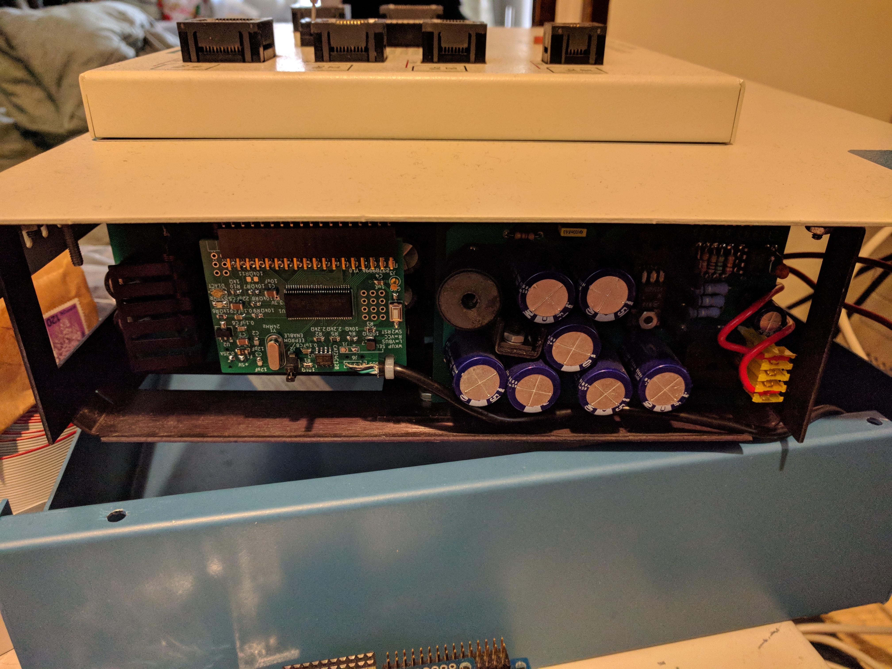

# Cypress FX2 Based Controller for Logical Devices' ALLPRO88 Software-Driven Device Programmer

## Overview

Thanks to the skilled work of kevtris reverse engineering one of these units and his kind generous sharing of his documents, I was able to design and put together this controller to get my own unit going.

kevtris, in addition to needing a control solution, also wasn't satisfied with the squealing power supplies, and so to solve all of the issues at once he devised a fancy card that replaces several of the power supplies and provides an FPGA-based custom CPU design for controlling the unit.

The approach here is different.  This is only a controller, no power supplies are replaced, and the controller is a simple EZ-USB FX2LP based circuit.

You can build your own easily with some pin header socket connectors, a protoboard, three resistors, and one of the "USB logic analyzer" boards you can find on AliExpress.  The "logic analyzer boards", as they're called, are actually just Cypress' FX2LP development board reference design.  The boards get shipped with a logic analyzer firmware which seems to have been ripped off some other product or another, but what's in the EEPROM is irrelevant, it gets replaced with this project's firmware.  Those boards are breakout boards providing access to all of the pins that are needed to implement this circuit.

What's here is the schematic of the circuit to build.  It's also a PCB layout that implements it.  If, instead of using this PCB, you go the route of using a USB logic analyzer board as-is, there is a small difference in the power management that needs to be considered, which will be mentioned below.

## Circuit Description

### Overview

The FX2LP chip provides an 8051 micro-controller running at a speedy 48 MHz.  The chip includes a USB device interface, which we use to get commands from the host and respond to queries.  It has an I2C master interface used mainly to extract a firmware image at boot from an external EEPROM, but that is available to be used for other stuff if one wishes.  The FX2LP also provides 3 8-bit general-purpose I/O ports, and 3 additional I/O pins intended to be used as control lines.

The chip runs at 3.3 V but all of the I/O lines are 5 V tolerant and will tolerate voltages on them even if the chip is off, making interfacing it to legacy 5 V circuitry very simple.

The ALLPRO88's original interface was a 36 pin ribbon cable connecting it to an ISA card.  The 36 lines consist of an 8 bit bi-directional data bus, a 12 bit address bus, three active-low control lines (!READ, !WRITE, and !RESET), and then a whole pile of grounds for signal integrity.  All signals are 5 V TTL logic compatible.

What we do is remove the cable, plug the FX2LP into the ALLPRO88's motherboard where the cable used to be, use two of the 3 control lines to drive the !READ, and !WRITE, lines, one of the 8 bit I/O ports to talk to the data bus, 1.5 of the other two 8 bit I/O ports to talk to the address bus, and one of the spare GPIO pins to control the !RESET line.  We route a USB connection to the hole on the ALLPRO88's back panel where the 36 pin connector used to be.  We siphon 5 V from a DIP socket on the ALLPRO88's motherboard, and use a 3.3 V linear regulator to power the FX2LP directly from the ALLPRO88.

### ALLPRO88 Bus Interface

Because of the design of the FX2LP's GPIO scripting system, the data bus must be connected to port B.  The !READ and !WRITE control lines must be connected to the FX2LP's programmable control lines.  Because the !RESET line is never toggled as part of I/O transactions we can connect it to a GPIO port, and use the third programmable control line for a status light.  That leaves the address bus being connected to port A and half of port D.

The FX2LP is 5 V tolerant, so no level shifting circuitry is required.  However, the ALLPRO88's motherboard has a pair of resistor array chips acting as bus terminators for the 36 conductor interface cable.  They're two orange DIP packages next to the pin header for the cable.  I believe these need to be removed from the motherboard, because they put too great a load on the FX2LP's I/O pins.  I believe they need to be removed, but don't know that for certain.  I removed them from my unit early during the development of this circuit because I couldn't get it to work and after some math decided those resistors were screwing it up, but I'm surprised that would be the case, I'm surprised they wouldn't have caused problems for the original ISA interface if that was true, so I don't know.  Removing them didn't fix the problems I was having, but I've never tried with them re-installed so I don't know what happens.  What is definitely true is that those bus terminators are not needed:  there is no bus to terminate, only a few centimetres of PCB traces connect the FX2LP to the chips on the motherboard.  They're also too close to the pin header onto which the interface board mounts and they interfere with the board if they're left.  I strongly recommend removing them.

### Power

5 V and GND are available on the usual pins of those DIP resistor array packages, so after removing them that provides a convenient source of power for the interface board.  I suggest soldering a pair of wires into the appropriate holes and running them to a connector.  This is the best option, because it ensures the FX2 runs through a hardware reset sequence when the the ALLPRO88 is turned on, and correctly indicates to the host when the USB device is active and when it isn't.

If you choose to build this using a USB logic analyzer board as-is, those boards are powered by the USB bus.  I think that's probably OK, I think it's safe to power the FX2LP chip and, possibly, drive the ALLPRO88's bus interface while the ALLPRO88 is off (that could have happened in the old days with the ISA interface driving a powered-off programmer), but the firmware will need to be modified in that case because it expects the WAKEUP pin to be monitoring USB VBUS.  That connection isn't made on those boards, so the firmware will believe the USB cable is disconnected and will turn off the USB interface.

Instead of modifying the firmware, another option if using a USB logic analyzer as-is is to cut the connection between the USB connector's VBUS pin and the input to the 3.3 V linear regulator.  Then jumper VBUS (available as the 5V pin on the break out connectors) to the WAKEUP pin through a resistor and capacitor network as in this circuit.  Finally, jumper the (now disconnected) 3.3 V regulator's input to the ALLPRO88's motherboard.

## Assembly

### Parts Source

If you have a hot air soldering station, the cheapest way to build one of these is to order a USB logic analyzer and salvage the parts from it.  Almost all of the required parts can be obtained from one of those boards, they can be had for well under $10 delivered, whereas the FX2LP part, alone, is more than $20 from Mouser (with delivery extra).  Without a hot air station removing the parts without damaging them will be very difficult.  In that case just buy them all new.  (the price difference doesn't come close to justifying buying a hot air station, but if you were thinking of getting one anyway maybe this is the time).

### Soldering Tips

Install the FX2LP first.  Hand-soldering it requires patience, and the more space you have to work the more patient you'll be, so it's best if there's not yet other stuff on the board.  Get a magnifying glass and check each pin of the chip one-by-one to make sure solder has flowed onto it and onto the pad, and hasn't bridged between pins.  Solder flux is your friend.  Everything else is easy to install.

### ALLPRO88 Connection

Two footprints are provided for a female pin header connector for the connection to the ALLPRO88 motherboard.  One option is a TE Connectivity 532956-6.  This is not cheap, but matches the style of the connectors used on the other boards in the system.  An alternative footprint is available for a standard, cheaper, right-angle female header connector as you'd find when doing a search for such things.

### USB Connection

There are two options for the USB connection to the PCB:  a footprint for a USB connector, and a footprint for soldered-in USB cable.  This is not the connection that the cable from the host PC makes, this is for an internal connection within the ALLPRO88 from the interface board to a USB connector on the rear panel (and that's where the cable from the host connects to).  The directly-soldered-cable option is less likely to become a point of failure in the future, but it means the interface board cannot be removed from the chassis without unscrewing the USB connector plate from the rear panel.  That can become inconvenient.  I initially soldered a cable directly to the board, then later decided I preferred having a connector I can pull a cable out of.

For the rear panel, I bought a USB 2.0 type B break-out board.  The shell of a USB 2.0 type B connector is almost exactly the height of the shell of the DB36 connector removed from the rear panel, and fits nicely into the space left by the connector.  I prefer the larger USB connectors, they're more resilient.  We're not sending this stupid thing into space, use a big connector.  To install it in the hole, I bought a piece of 90 degree aluminum angle extrusion at a local hobby shop.  I cut it to a suitable length with a hack saw, and then used a drill, a small file, and lots of patience to carve out holes and notches for the USB connector and its break-out board.  I reused the original screws from the DB36 connector to mount the aluminum angle into the ALLPRO88 case.

Just a little blue paint, and it would look like it was always that way.

### Other Connections

I2C and GPIO headers.  These can be left unpopulated.  It's hard to find connectors that fit into the pin pitch I chose.  That's my bad.  They're not used for anything, they're just there in case somebody wants to play with them in the future.  There are three spare GPIO lines on port D that get routed to J8, along with 3.3 V and GND.  The FX2's I2C clock and data lines, and 3.3 V and GND, are routed to J1.  The ALLPRO88's socket module connectors have many unused pins on them, and one could jumper these signals from the controller board to unused pins on the socket module connectors on the ALLPRO88's motherboard, thereby making them available to custom socket modules.  A little I2C display could be added to show status messages, for example.

## Smoke Test and Firmware Upload

DO NOT connect the module to the ALLPRO88 bus interface before writing the proper firmware to the EEPROM.  Apply power to the board and see if looks OK.  If it hasn't caught fire, and the 3.3 V test point shows the correct voltage, plug it into your computer and see what it shows up as.  If you salvaged parts from a USB logic analyzer board it'll probably show up as that, otherwise it'll probably show up as an FX2 chip in its raw state.  Either way that tells you it's working.  Write the firmware to the EEPROM, then power cycle it and it should report itself as an ALLPRO88 USB interface.

NOW you can plug it into the ALLPRO88's motherboard.  With the controller installed, turn on the ALLPRO88.  The "BUSY" light on the socket module should briefly blink.  When the controller is turned on, it enables the main power supply and runs through a channel scan to determine which pin driver modules are installed.  That process is the BUSY light blinking.  If you don't see the light blink once, briefly, probably something's wrong.

If, when you apply power, the BUSY light comes on and stays on, turn off the ALLPRO88.  That almost certainly indicates the !RESET line is not being driven properly.  That needs to be diagnosed and fixed before moving on.  When its interface bus is floating, the ALLPRO88 powers up with the main power supplies active.  I don't know why, it doesn't seem wise, it can potentially damage the circuitry, but that's the design.  !RESET must be asserted to clear that state.  The controller circuit has a pull-down resistor on !RESET to ensure it's held in the asserted state until the FX2 firmware has booted and can take control, so if your BUSY light is on and won't turn off it means that the pull-down resistor is not doing what it's supposed to do and also that the FX2 firmware is not starting and doing what it needs to do.  Both are serious problems that need to be rectified.
